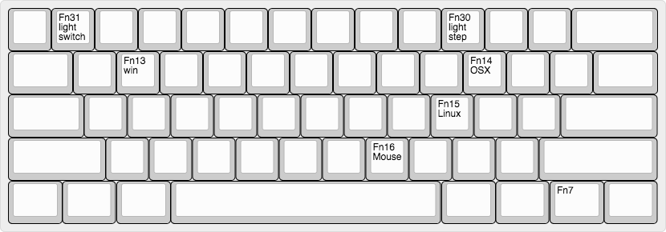
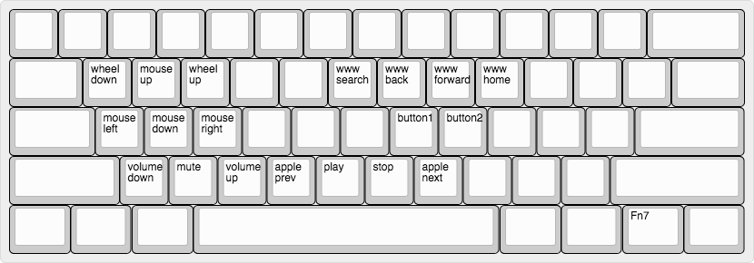
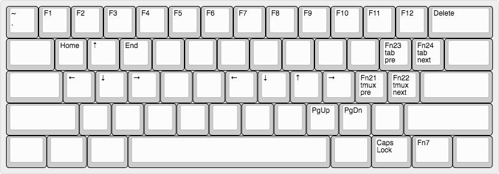
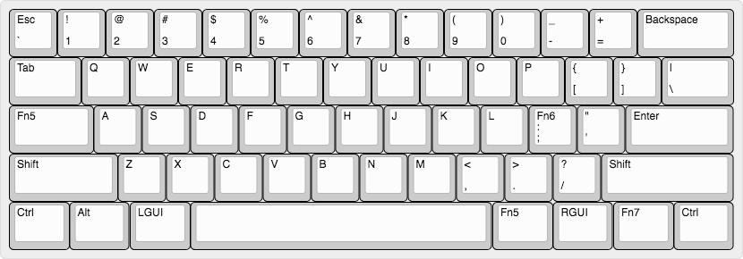

# Fmajor's keyboard firmware for gh60
Based on
* https://github.com/andrewcchen/tmk_keyboard/

Build with
* https://tkg.io/
* https://github.com/kairyu/tkg-toolkit
* http://www.keyboard-layout-editor.com/
# Layers
* Layer 7 ([Layer switcher](http://www.keyboard-layout-editor.com/#/gists/7215754963a5c06f8fc111e3f0a3c1dd))
)): 
* Layer 6 ([Mouse layer](http://www.keyboard-layout-editor.com/#/gists/5112b634bb41e640fe46fa641a4392d3)): 

* Layer 5 ([Navigation](http://www.keyboard-layout-editor.com/#/gists/02b061bc00c46da3019d0567ff473696)): 

* Layer 0 ([Default layer](http://www.keyboard-layout-editor.com/#/gists/448ce7bcb36235243dcf02ed5bb38555)): 

# Function keys
*  Fn5: Use navigation layer, use the most
*  Fn6: Use mouse layer when holding, tap to input ";"
*  Fn7: Use layer 7 (special layer to set keyboard type and toggle mouse layer)
* Fn16: Toggle the mouse layer
* Fn13: Set to Window mode (currently same as linux mode)
* Fn14: Set to OSX mode (see Fn23 and Fn24 for detail)
* Fn15: Set to linux mode(see Fn23 and Fn24 for detail)

Fn 21 and Fn 22 are 'tmux pre' and 'tmux next' (my tmux prefix is Ctrl+N)
* Fn21: Ctrl + N, n
* Fn22: Ctrl + N, p

Fn 23 and Fn 24 are 'tab pre' and 'tab next', they can switch between all kinds of tabs (Termial tabs, Chrome tabs, atom tabs and so on...)
* Fn23: Ctrl + PgUp in linux mode, Shift + Cmd + [ in OSX mode
* Fn24: Ctrl + PgDown in linux mode, Shift + Cmd + ] in OSX mode
* Fn30: Background layer step change
* Fn31: Background switch
# Hocks
* When layer n (n>0) are active, the CapsLock light is on.
# Build
``` bash
$ make ubuntu_tools # if you do not use ubuntu, install the packages by yourself
$ make # build the frame
$ make flash # flash it
```
# Comments
I have used
* Tninkpad Red Point keyboard
* Poker II keyboard
* Obins ANNE keyboard

The gh60 should be my last keyboard, enjoy it :)
